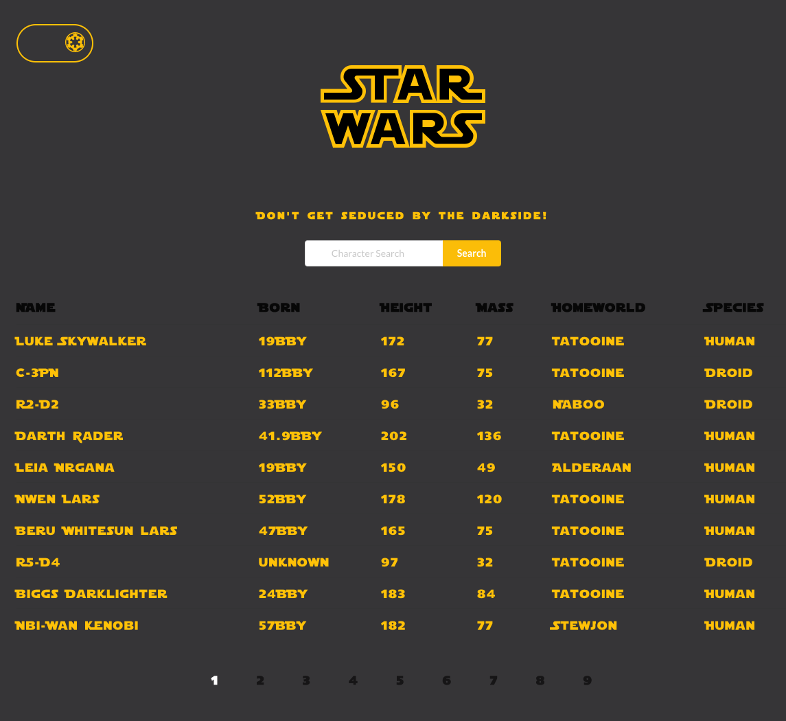
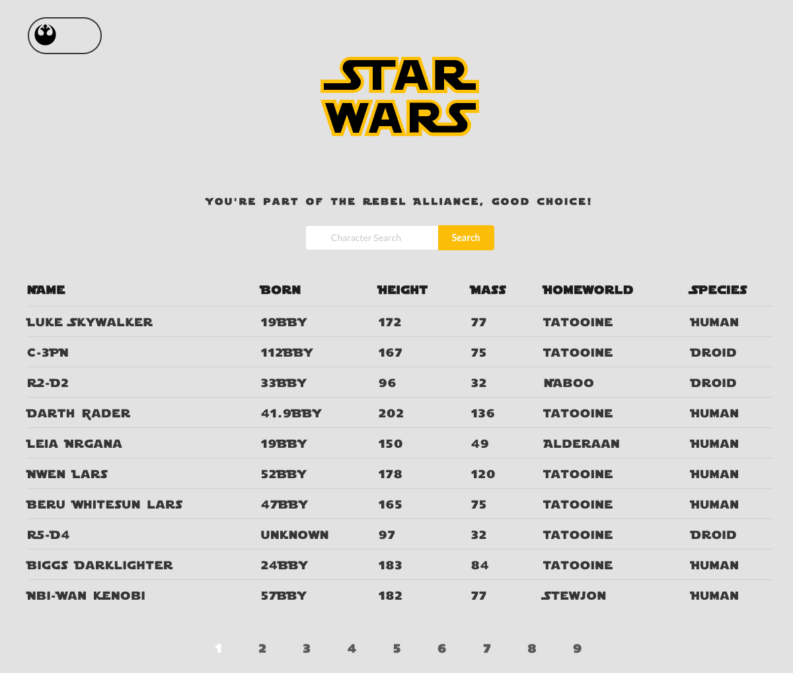

# Starwars

Checkout the project [HERE](https://aa-starwars.netlify.app/)

A small React App to practice working with APIs

## Summary

API used from [Swapi.dev](https://swapi.dev/)

### Author

- Ahmed Abdelaal - [Website](https://aa-dev.io/) | [LinkedIn](https://www.linkedin.com/feed/)
